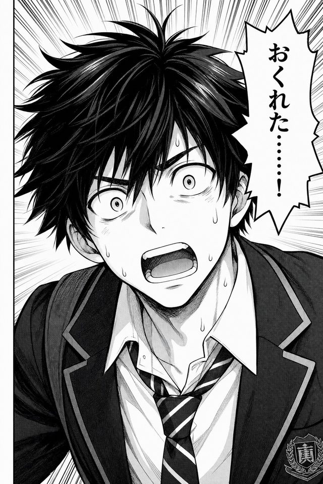
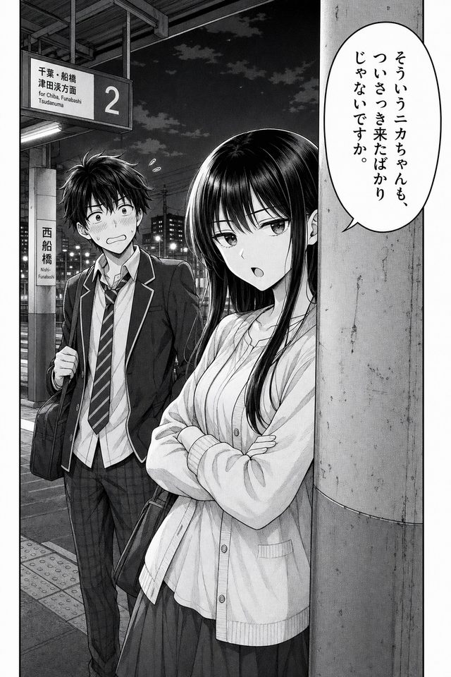
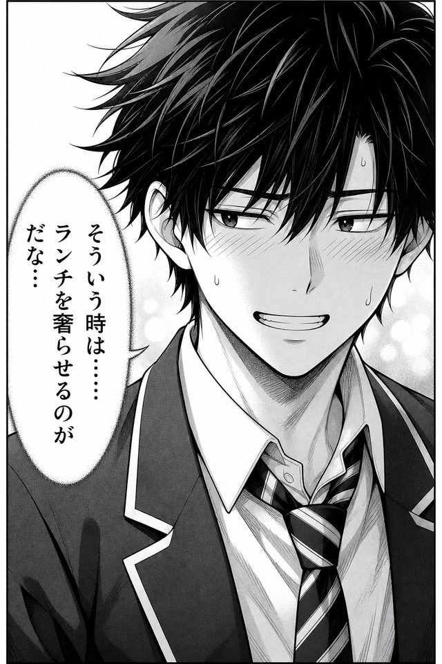
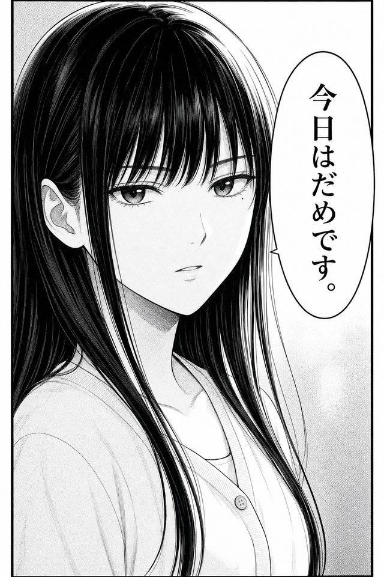

# メディアプロファイル

コアは共通。メディア固有の記号・慣習はプロファイルとして足す。

ヘッダー例:

```mes
profile: manga
----
```

未指定時は `audio`（Mes 互換の読み）を既定とする。

## profile: audio（優先度 1）

音声ドラマ・ASMR・朗読など。

重視するデコレーター: `@ # $ ! &`

```mes
profile: audio
title: 駅前
----
@にか
#改札を出て、周囲を探す
$雑踏。遠くで電車の発車ベル
!正面やや右
あ、キタキタ。女の子二人を待たせるなんて、失礼だぞ。
```

指針:

- `$` に「何の音か」を書く。演技指示は `#` へ
- `!` はパン / 距離のメモ。厳密な座標系は求めない
- `&` は字幕・尺合わせが必要なときだけ

## profile: manga（優先度 1）

ネーム・コンテ的なページ/コマ記述。

重視するデコレーター: `@ # % ^ *`（`$ !` も可）

1ページ分のネーム例（実ファイル: [examples/manga/station-name.mes](../../examples/manga/station-name.mes)）:

```mes
profile: manga
title: 駅前の二人（ネーム）
----
== 1ページ

%1
^俯瞰ぎみ・広目
#夕方の改札前。人波。にかが焦って入ってくる
$雑踏（小さく）

%2
^にかバストアップ
@にか :表情 焦り
おくれた……！

%3
^二人を入れる引き
#こいとが柱の陰から半歩出る
@こいと :表情 呆れ
そういうニカちゃんも、ついさっき来たばかりじゃないですか。

%4
^にか寄り（汗）
@にか :表情 苦笑
#視線を逸らしながらボソッ
そういう時は……ランチを奢らせるのがだな…

%5
^こいと寄り
@こいと :表情 真顔
今日はだめです。
```

### 参考画像（サンプルテキストから生成）

漫画プロファイルのサンプルは、テキストだけだと構図の感触が伝わりにくい。  
上の **1ページ（5コマ）** から生成した参考画像を、サンプルテキストの直下に置く（原稿の一部ではない。二次ツール側の読み物）。

| コマ | 参考画像 |
|------|----------|
| `%1` 俯瞰ぎみ・広目（セリフなし） |  |
| `%2` にかバストアップ |  |
| `%3` 二人を入れる引き |  |
| `%4` にか寄り（汗） |  |
| `%5` こいと寄り |  |

コマごとにテキストと画像を並べた読み方は [examples/manga/](../../examples/manga/) を参照。

指針:

- `%` の値はコマ番号、または短いコマ内容メモ
- セリフのないコマも合法（`%` と `#` / `^` だけ）
- ページ区切りは `==` セクションを推奨
- 吹き出し種別が必要なら `@名前 :吹き出し 心の声` など属性で
- **参考画像** は MesLang 本文に埋め込まない。サンプル提示・ネーム起こし確認など二次側で、対応する `%` の下に並べる（[ADR 0004](../decisions/0004-manga-reference-images.md)）

## profile: anime（優先度 2）

字コンテ・カット表の下地。

重視するデコレーター: `% ^ & # @ $`

```mes
profile: anime
----
%CUT-012
^寄り → 引き / 手持ちの揺れ
&3.5s
#にかが立ち止まり、振り返る
@にか :表情 不安
……だれか、いないよね？
$街の環境音を少し絞る
```

指針:

- `%` はカット ID
- `^` はカメラ指示（アングル / 移動 / レンズ感）
- `&` に秒数目安

## profile: vn（優先度 3・未着手）

ビジュアルノベル。分岐・選択肢はここでは定義しない。  
立ち絵差分は `@名前 :表情 …` で足りることが多い。必要になったら別 ADR。

## プロファイルの重ね方

未知のデコレーター行は、厳格モードでなければ **ext として保持** し、落とさない。  
AI 変換や将来のパーサが解釈できるように、原文を残す。
